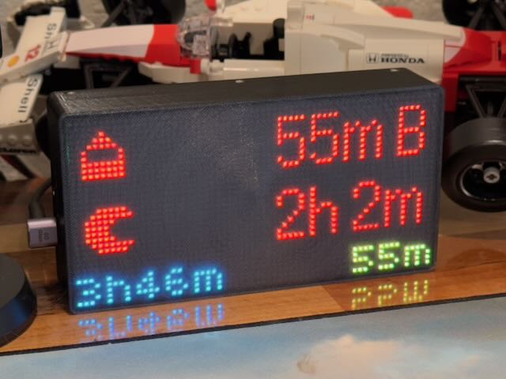

# MatrixPortal case

This is a 3D printed enclosure that lets you put an RGB LCD matrix behind a diffuser and run CircuitPython or Arduino code on it.

## Electronics needed

Prices are USD as of the authoring of this document.

| Item | Price/Vendors |
| ---- | ----- |
|  2.5mm pitch 64x32 LED matrix | $39.99 ([Adafruit](https://www.adafruit.com/product/5036), [DigiKey](https://www.digikey.com/en/products/detail/adafruit-industries-llc/5036/14671681), [Mouser](https://www.mouser.com/ProductDetail/Adafruit/5036)) |
| Adafruit MatrixPortal S3 | $19.95 ([Adafruit](https://www.adafruit.com/product/5778), [DigiKey](https://www.digikey.com/en/products/detail/adafruit-industries-llc/5778/21839792), [Mouser](https://www.mouser.com/ProductDetail/Adafruit/5778)) |
| Adafruit STEMMA QT RTC* | $4.95 ([Adafruit](https://www.adafruit.com/product/5189), [DigiKey](https://www.digikey.com/en/products/detail/adafruit-industries-llc/5189/15189154), [Mouser](https://www.mouser.com/ProductDetail/Adafruit/5189)) |
| 100mm STEMMA QT cable* | $0.95 ([Adafruit](https://www.adafruit.com/product/4210), [DigiKey](https://www.digikey.com/en/products/detail/adafruit-industries-llc/4210/10230021), [Mouser](https://www.mouser.com/ProductDetail/Adafruit/4210)) |

\* RTC and STEMMA QT cables only needed if you need one, like with the [paired Baby Buddy software](https://github.com/skjdghsdjgsdj/matrixportal-babybuddy).

## Other stuff needed

You also need:

* A 3D printer and know-how
* A filament of your choice, plus a transparent, semi-transparent, or white filament to act as a diffuser for the LED matrix
* A [CR1220 battery](https://www.adafruit.com/product/380) if you're using the RTC
* Screws:
  * Four M3x4 screws if you're using the RTC
  * Four M2.5x6 screws for mounting the MatrixPortal S3
  * Six M3x25 screws for mounting the LED matrix to the backplate
  * Eight *self-tapping countersunk* M2x4 screws for connecting the backplate to the enclosure with the diffuser
* A USB C cable to actually use the device when you're done

## Assembly

No soldering!

1. Slice and print `Enclosure.stl` in the project's releases with some important details:
	* Start a [color change](https://help.prusa3d.com/article/color-change_1687) in the model just after the diffuser prints. Depending on your layer height, this is around 0.6mm.
	* Use a transparent, [semi-transparent](https://www.microcenter.com/product/626543/inland-175mm-petg-3d-printer-filament-1kg-(22-lbs)-spool-translucent-gray), or white filament for the diffuser and whatever other color you want for the rest of the print.
	* Print the file with the diffuser facing down (on the bed).
2. Slice and print `Baseplate.stl` in the project's releases with the flat part facing down and the various screw posts pointing up. Print with just one color: the same as the main part (not diffuser) of `Enclosure.stl`.
3. Plug the ribbon cable that comes with the MatrixPortal S3 into the board and the other end into `J2` of the LED matrix, then screw it into the backplate with four M2.5x6 screws.
4. If using the RTC, insert the battery, screw it into its standoffs with four M3x4 screws, then plug the STEMMA QT cable into either port on the RTC and the other end to the MatrixPortal S3.
5. Remove the brown plastic covers on the +5V and GND screw terminals on the MatrixPortal S3, then using the red/black cable that came with the LED matrix, screw the red cable to the +5V terminal and the black cable to the GND terminal. Use the screws that came with the MatrixPortal S3 and make sure they're tight.
6. Plug either connector on the red/black cable to the power connector on the LED matrix. The other connector (doesn't matter which one) remains disconnected.
7. Use six M3x25 screws to attach the LED matrix to the backplate through the long standoffs. Be careful shoving all the cables between the backplate and the LED matrix that nothing gets crushed or disconnected; it's a tight fit.
8. Screw the enclosure to the backplate using eight countersunk M2x4 self-tapping screws around the perimeter.
